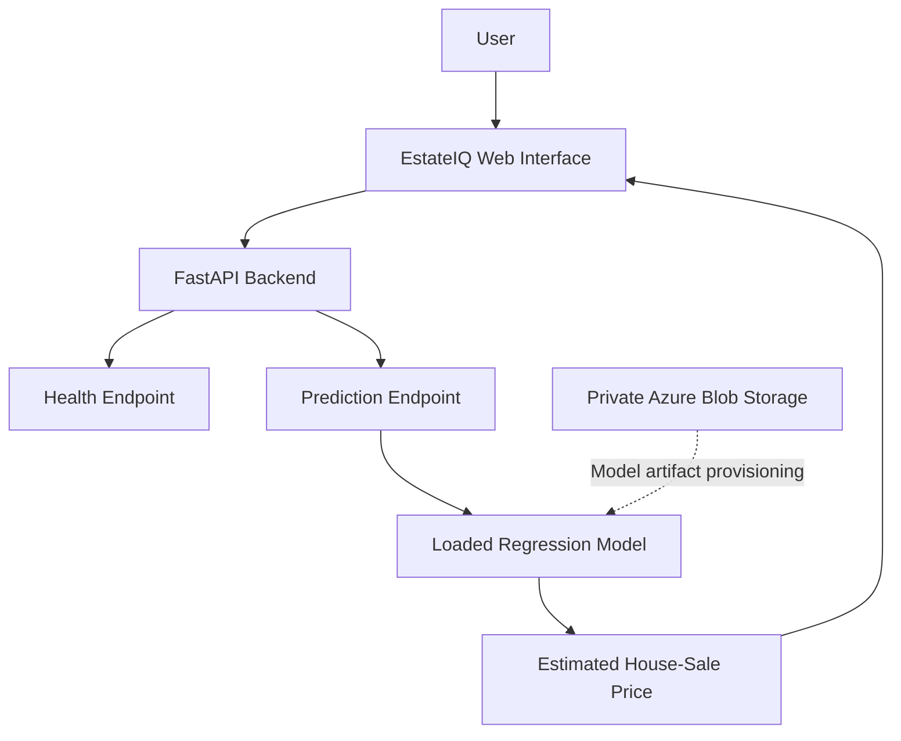
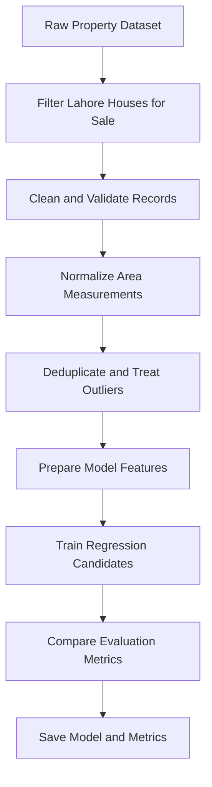
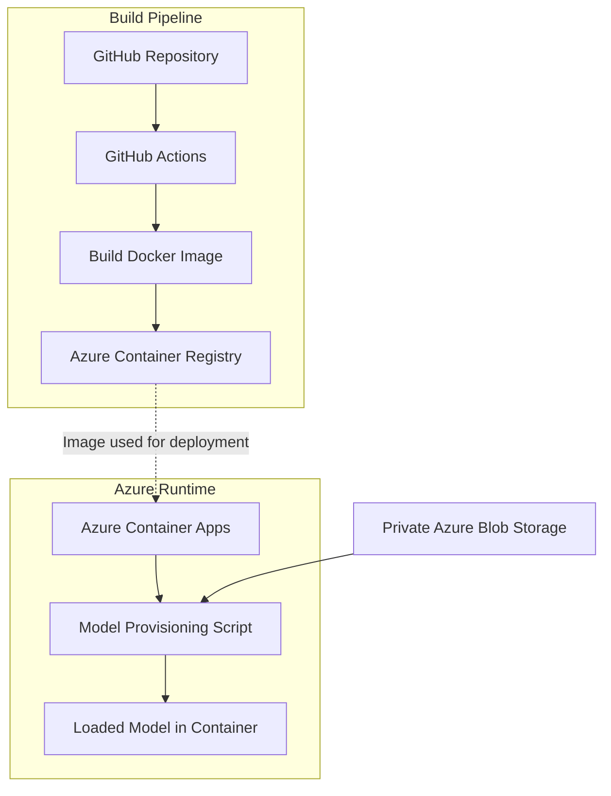

# EstateIQ — Lahore Property Valuation

**From a house-price prediction exercise to a deployed machine-learning application.**

EstateIQ is a Lahore-first property valuation application built around a machine-learning regression pipeline and a FastAPI backend. It takes a conventional house-price prediction project further by connecting data preparation, model training, API development, containerization, and cloud deployment into one working application.

**[Live Application](https://estateiq-lahore.prouddune-19aad06e.uaenorth.azurecontainerapps.io) · [Health Check](https://estateiq-lahore.prouddune-19aad06e.uaenorth.azurecontainerapps.io/health) · [Source Code](https://github.com/MYaseenLiaqat/property-price-prediction)**

> **Model scope:** The currently trained model estimates historical Lahore house-sale asking prices. It is not a live-market valuation service, and the Buy and Rent interface options should not be interpreted as independently trained models.

---

## Project at a Glance

| Area | Implementation |
|---|---|
| Application | EstateIQ |
| Primary use case | Lahore house-sale price estimation |
| Machine learning | Regression, Random Forest, Extra Trees |
| Backend | Python, FastAPI |
| Frontend | Web interface served with the application |
| Model artifact | Joblib |
| Containerization | Docker |
| CI image pipeline | GitHub Actions |
| Cloud runtime | Azure Container Apps |
| Container registry | Azure Container Registry |
| Model storage | Private Azure Blob Storage |

## 1. Why I Built EstateIQ

The project began as a way to practise supervised machine learning with a house-price dataset and regression algorithms.

Rather than stopping after training a model, I extended the project into a deployable application. This involved preparing the dataset, comparing candidate models, saving the selected model, exposing predictions through an API, creating a browser-based interface, packaging the service in Docker, and running it in Azure.

The objective was to understand how a machine-learning model moves from experimentation into an application that people can access.

## 2. Application Architecture

The browser communicates with the FastAPI backend. The backend validates prediction requests, uses the loaded model to generate estimates, and returns a response to the frontend. The trained model is provisioned from private cloud storage rather than requiring the large artifact to be committed to Git.



### Request lifecycle

1. The user enters property information in the web interface.
2. The frontend sends a prediction request to the backend.
3. FastAPI validates and processes the request.
4. The trained model produces an estimate.
5. The backend returns the result to the frontend.

The `/health` endpoint provides a basic service and model-loading health check.

## 3. Machine-Learning Pipeline

The training pipeline uses the Open Data Pakistan Zameen property dataset as its source. The selected data is narrowed to Lahore house-sale listings before model preparation and training.



### Main processing steps

- Filter records to the project's Lahore house-sale scope.
- Normalize property area to square feet.
- Remove invalid or implausible values.
- Deduplicate records where a suitable identifier is available.
- Trim extreme price-per-square-foot outliers according to the training pipeline.
- Compare Random Forest and Extra Trees regression models.
- Save the selected model and evaluation results.

The training script and saved metrics provide the basis for reviewing the model. Evaluation results should be interpreted in the context of the dataset's age, quality, and limited market coverage.

## 4. Data Source and Limitations

**Dataset:** [Zameen Property Data — Open Data Pakistan](https://opendata.com.pk/dataset/property-data-for-pakistan)

The dataset contains historical property listings. The published dataset was last updated in May 2020, so it should not be treated as a representation of current Lahore property prices.

Important limitations:

- Listing asking prices are not necessarily completed transaction prices.
- The data may not represent today's market conditions.
- Historical listings can contain inconsistent, missing, or inaccurate information.
- The model's estimates are not professional valuations or guarantees of a property's market value.
- The current trained model is scoped to historical house-sale estimates; rental valuation requires appropriate rental data and a separately validated approach.

Please consult `DATA_POLICY.md` and `data/reference/sources.md` for additional project-specific information.

## 5. Deployment Architecture

EstateIQ runs in Azure Container Apps. The Docker image is stored in Azure Container Registry, while the large model artifact is stored separately in a private Azure Blob Storage container.



### Model artifact handling

The trained model is large enough that keeping it directly in the Git repository is undesirable. Instead, the application uses an external artifact workflow:

1. The model artifact is stored in private Azure Blob Storage.
2. The container receives a configured model artifact URL and expected SHA-256 checksum.
3. The provisioning script downloads the artifact.
4. The checksum is verified before the artifact is installed.
5. The backend loads the provisioned model for inference.

This separates application code from the large binary model and adds an integrity check to the artifact retrieval process.

### CI pipeline status

The current GitHub Actions workflow builds and pushes a Docker image to Azure Container Registry when relevant application files change on `main`, or when manually triggered.

**The workflow does not currently update Azure Container Apps automatically.** Updating the running application remains a separate deployment step. The diagram above describes the components and their relationships, not a claim that every deployment action is automated.

## 6. Run Locally

### Prerequisites

- Python 3.11
- Git
- A virtual environment
- Access to the dataset for training
- A configured model artifact source for running inference

### Setup

Clone the repository:

```bash
git clone https://github.com/MYaseenLiaqat/property-price-prediction.git
cd property-price-prediction
```

Create and activate a virtual environment.

**Windows PowerShell**

```powershell
py -3.11 -m venv .venv
.\.venv\Scripts\Activate.ps1
```

Install dependencies:

```bash
python -m pip install --upgrade pip
pip install -r requirements.txt
```

### Prepare and train the model

Download the source dataset:

```bash
python scripts/download_open_data.py
```

Train the Lahore house-sale model:

```bash
python scripts/train_lahore.py
```

The training pipeline generates the model artifact and evaluation metrics in the `models/` directory.

### Provision the model and run the application

For inference, configure the model artifact URL and its expected checksum using the project's supported environment configuration. Then provision the model:

```bash
python scripts/provision_model.py
```

Start the backend and application:

```bash
python -m backend.main
```

Open the local address printed by the application or configured for the service. By default, the backend uses port `8000`.

Check the service health endpoint at:

```text
http://localhost:8000/health
```

**Note:** The external model artifact is not included in the repository. Training and inference have different prerequisites: training requires the dataset, while inference requires the trained model artifact.

## 7. Repository Structure

```text
property-price-prediction/
├── .github/
│   └── workflows/
├── backend/
├── frontend/
├── data/
│   └── reference/
├── docs/
├── models/
├── scripts/
├── tests/
├── Dockerfile
├── requirements.txt
├── render.yaml
├── ARCHITECTURE.md
├── DATA_POLICY.md
├── PROJECT_SCOPE.md
├── PROJECT_ROADMAP.md
└── README.md
```

The repository separates the API, frontend, model artifacts and metrics, data references, training scripts, tests, and supporting documentation.

## 8. Engineering Decisions

**Separate model storage:** The large trained model is kept outside Git and provisioned when needed.

**Artifact integrity:** A SHA-256 checksum helps verify that the downloaded model matches the expected artifact.

**API-based inference:** FastAPI separates model inference from the browser interface.

**Containerized runtime:** Docker provides a repeatable application packaging approach.

**Cloud hosting:** Azure Container Apps makes the application accessible without requiring users to run it on a local machine.

**Documented limitations:** Dataset age and model scope are explicit so estimates are not mistaken for verified current-market valuations.

## 9. Future Improvements

- Evaluate against newer, appropriately licensed Lahore property data.
- Add time-aware validation and document model performance with reproducible metrics.
- Improve feature engineering and error analysis.
- Add prediction intervals or uncertainty estimates.
- Develop and validate a separate rental-price model using suitable rental data.
- Add automated deployment from GitHub Actions to Azure Container Apps.
- Introduce deployment smoke tests, structured logging, and model monitoring.

## 10. Disclaimer

EstateIQ is an educational and engineering project. Its estimates are based on historical listing data and should not be used as the sole basis for buying, selling, renting, financing, or investing in property.

For source attribution, licensing information, development instructions, and additional technical details, consult the supporting project documentation.

